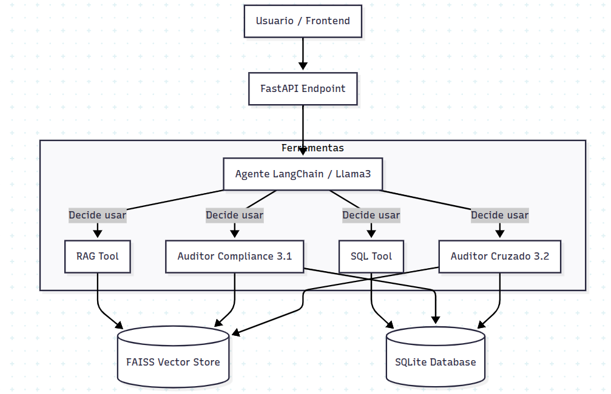
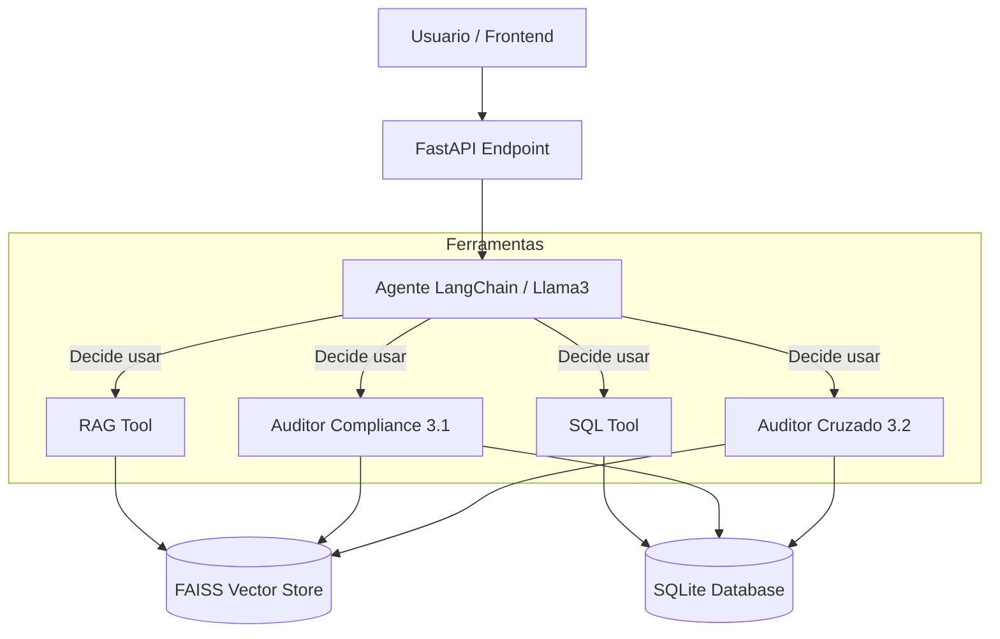

# Dunder Mifflin Compliance Auditor (The "Toby-Bot") - README feito com ajuda de IA Generativa!

> "Eu odeio muito todas as coisas que você escolhe ser." — Michael Scott para Toby.

Este projeto é um **Agente de Inteligência Artificial** desenvolvido para atuar como auditor da Dunder Mifflin. O sistema foi projetado para auxiliar o RH (Toby Flenderson) a identificar violações de compliance, analisar gastos excessivos e detectar fraudes complexas através do cruzamento de dados não estruturados (e-mails) com dados estruturados (transações bancárias).



---

## Arquitetura do Projeto

O projeto utiliza uma arquitetura baseada em **Agentes e Ferramentas (Agentic RAG)**, orquestrada pelo framework **LangChain**.

### Diagrama de Funcionamento

A API de LLM usado do sistema (LLM Llama 3 via Groq) recebe a pergunta do usuário e decide dinamicamente qual ferramenta acionar:




### Componentes Tecnicos

- **LLM:** Llama 3.3 70B (via Groq API). Escolhido pela alta velocidade de inferencia e capacidade de raciocinio logico.
- **Orquestracao:** LangChain (gerenciamento de tools e memoria).
- **Banco Vetorial (RAG):** FAISS + HuggingFace Embeddings (all-MiniLM-L6-v2) para indexar politicas e e-mails.
- **Banco Relacional:** SQLite para armazenar e consultar as transacoes financeiras (`transacoes_bancarias.csv`).
- **API:** FastAPI para servir o agente.

---

## Como Rodar o Projeto

### Pre-requisitos

- Python 3.9+
- Uma chave de API da Groq (gratuita) - https://console.groq.com/keys.

### Passo a Passo

Clone o repositorio:

```bash
git clone https://github.com/seu-usuario/seu-repositorio.git
cd seu-repositorio
```

Crie e ative o ambiente virtual:

```bash
python -m venv venv
# Windows:
venv\Scripts\activate
# Linux/Mac:
source venv/bin/activate
```

Instale as dependencias:

```bash
pip install -r requirements.txt
```

Configure as variaveis de ambiente:

Crie um arquivo `.env` na raiz do projeto (`backend/`).

Adicione sua chave da Groq:

```env
GROQ_API_KEY=gsk_sua_chave_aqui_...
```

### Ingestao de Dados (ETL)

Antes de rodar a API, e necessario processar os arquivos CSV e TXT para criar o banco SQL e o indice vetorial.

```bash
cd src
python ingest_data.py
```

Isso criara a pasta `data/dunder_mifflin.db` e `data/faiss_index`.

Inicie a API:

```bash
python main.py
```

O servidor iniciara em `http://localhost:8000`.

---

## Funcionalidades e Requisitos Atendidos

O sistema foi desenhado para cumprir os quatro niveis de desafio propostos:

### 1. Chatbot de Politica (RAG)

O agente consulta o arquivo `politica_compliance.txt` para responder duvidas.

Exemplo de prompt:

"Quais sao as regras para jantares com clientes?"

### 2. Analise de E-mails (Conspiracao)

O sistema busca em `emails_internos.txt` por mencoes a Michael Scott ou conflitos.

Exemplo de prompt:

"O que o Michael esta planejando contra o Toby?"

### 3.1. Verificacao Automatica de Compliance (SQL + Regras)

Uma ferramenta autonoma que le as regras e gera queries SQL para encontrar violacoes diretas (por exemplo, gastos acima de 500 dolares ou categorias proibidas como "Magica").

Exemplo de prompt:

"Faca uma varredura por quebras de compliance nas transacoes."

### 3.2. Auditoria Cruzada (Contextual Fraud)

O principal diferencial do sistema. Ele cruza **intencionalidade** (texto presente em e-mails) com **materialidade** (dados existentes no banco).

- Busca e-mails com termos suspeitos ("esconder", "segredo", "lanca como").
- Extrai quem, o que e quando.
- Verifica no banco SQL se a compra foi efetivamente realizada, caracterizando a fraude.

Exemplo de prompt:

"Verifique se ha e-mails indicando intencao de fraude e cruze com o banco para confirmar se a compra ocorreu."

---

## Video de Demonstracao

### [Vídeo Youtube](https://youtu.be/73GoqEr_-cU)

O video demonstra o sistema rodando localmente, o processo de ingestao dos dados e as respostas para os casos de uso de Auditoria 3.1 e 3.2.

---

## Tecnologias Utilizadas

- LangChain
- FastAPI
- Groq Cloud
- FAISS
- Pandas
- SQLAlchemy
